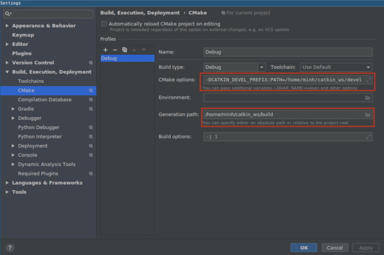
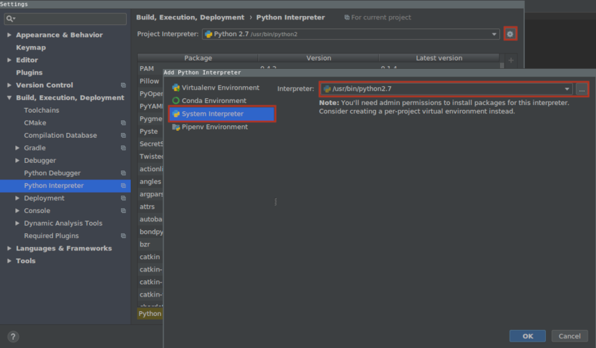
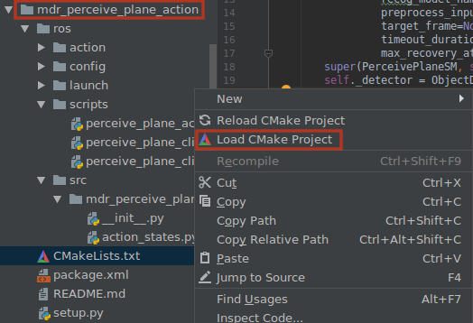

# CLion

[CLion](https://www.jetbrains.com/clion/) is a JetBrains Integrated Development Environment \(IDE\) for C++. While normally a paid product, like with other JetBrains IDE, CLion can be registered with a university email. Please also check [the tutorial provided by JetBrains](https://www.jetbrains.com/help/clion/ros-setup-tutorial.html) for setting up CLion with ROS.

Because CLion can load `CMakeLists.txt` project directly, and because it is a JetBrains product and naturally loads Python packages and modules, it fits nicely with ROS packages. In order for package indexing to work, however, some configuration is necessary.

* First, you must add a directory as a new project. This can either be the entire catkin workspace or the `src` folder in that workspace.
* In order to load the correct ROS environments, it's necessary to launch clion from the terminal, with the appropriate `setup.bash` \(or `setup.zsh`\) loaded.

### C++ configuration

The generation path and the `catkin` build destination must be specified. In the `File --> Settings` dialog box, select the `Build, Execution, Deployment --> CMake` menu, and:

* add `-DCATKIN_DEVEL_PREFIX:PATH=/path/to/catkin/workspace/devel` to the `CMake options` field
* add `/path/to/catkin/workspace/build` to the `Generation path` field

### Python configuration

In order for CLion to index Python packages, you must point to the correct Python interpreter. Since ROS uses a Python 2 system interpreter, this needs to also be used for your project \(in future ROS versions this will hopefully change\). In the `Build, Execution, Deployment --> Python Interpreter` setting menu, if the correct interpreter is not automatically detected, click on the gear icon to add a new interpreter.

### Load `CMakeLists.txt`

After the above configurations, you're ready to load ROS `CMakeLists.txt` projects. Navigate to the package that you want to work on, right click on the `CMakeLists.txt` file, and click `Load CMake Project`.

